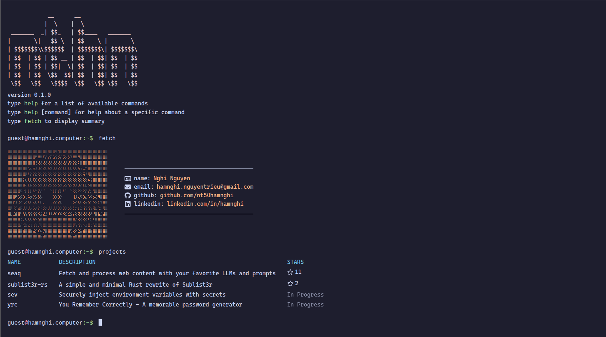

# wcli

A terminal-style portfolio website built with [Leptos](https://leptos.dev/) and [Tailwind CSS](https://tailwindcss.com/).

## Demo

Visit the live site: [hamnghi.computer](https://hamnghi.computer)

</a>

## Features

- Interactive CLI in the browser
- Switchable themes
- Command history with navigation
- Tab-completion for commands
- Easy configuration through a TOML file (WIP)

## Deployment

TODO: Add deployment instructions

## Acknowledgments

Special thanks to:
- **Niklas Ziermann** - for making [this video](https://www.youtube.com/watch?v=KCcU15nvFbI) that helped me get started
- **Wensen (Vincent) Wu** - for making [LiveTerm](https://github.com/Cveinnt/LiveTerm) that inspired this project
